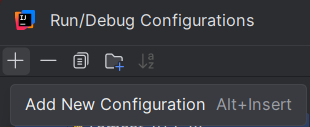
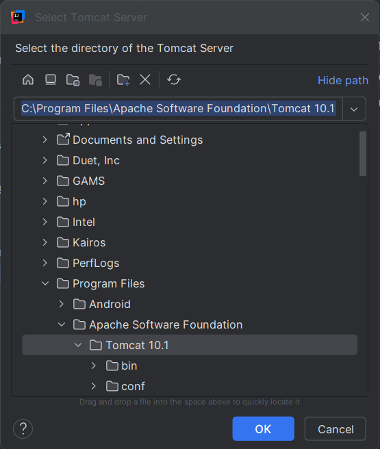

## PostGreSQL DB and Table setup:
 
1. Install PostgreSQL v15.8 using these [instructions](https://www.youtube.com/watch?v=0n41UTkOBb0).
2. In PosgreSQL (after connecting), open the Query Tool, paste the following line, and Execute Script (F5)    
(It may be necessary to refresh: `Servers` -> `Refresh`):
 
   ```sql
   CREATE DATABASE LibraryManagementDB;
4. Right click on LibraryManagementDB -> Query Tool
5. Paste the following script, and Execute Script (F5)   
(It may be necessary to refresh):
 
   ```sql
    -- Create the Register table
    CREATE TABLE Register (
        username VARCHAR(50) PRIMARY KEY,
        name VARCHAR(60) NOT NULL,
        surname VARCHAR(60) NOT NULL,
        password VARCHAR(50) NOT NULL,
        phone VARCHAR(10),
        email VARCHAR(50)
    );
    -- Insert sample records into the Register table
    INSERT INTO Register (username, name, surname, password, phone, email) 
    VALUES ('johndoe', 'John', 'Doe', 'john123', '0123456789', 'johnd@gmail.com');
    INSERT INTO Register (username, name, surname, password, phone, email) 
    VALUES ('janedoe', 'Jane', 'Doe', 'jane123', '0123456788', 'janed@gmail.com');
   
    -- Create the Login table
    CREATE TABLE Login (
        username VARCHAR(50) PRIMARY KEY,
        password VARCHAR(50) NOT NULL,
        FOREIGN KEY (username) REFERENCES Register(username)
    );
    -- Insert sample records into the Login table
    INSERT INTO Login (username, password) VALUES ('johndoe', 'john123');
    INSERT INTO Login (username, password) VALUES ('janedoe', 'jane123');
 
5. Tables can now be seen under `librarymanagementdb` -> `schemas` -> `tables`.
 
## Tomcat Server Installation & Configuration:
 
### Installation
1. **Download Tomcat Server:**
   - Visit the following website [Apache Tomcat Server Downloads](https://tomcat.apache.org/download-10.cgi).
> [!NOTE]
> Ensure that you download version 10.1.28 for compatibility.
2. **Get the Windows Installer:**
   - Navigate to the (bold) Binary Distributions section.
   - Download the Windows Service Installer directly from this link: [Tomcat Server Windows Installer (apache-tomcat-10.1.28.exe)](https://dlcdn.apache.org/tomcat/tomcat-10/v10.1.28/bin/apache-tomcat-10.1.28.exe)
3. **Run the Installer:**
   - Launch the downloaded `.exe` file.
   - During installation, follow these steps:
     - **Component Selection:** Ensure that both Host Manager and Examples are selected
      
     - **Default Settings:** Leave all other installation options as their default.
 
### Configuration in IntelliJ IDEA
 
1. **Install the Smart Tomcat Plugin:**
   - Go to `File` > `Settings` > `Plugins`.
   - Search for `Smart Tomcat` in the Marketplace and install it.
2. **Configure Tomcat in IntelliJ IDEA:**
   - Navigate to the `Run` tab and select `Edit Configurations`.
   - Click on the `+` button to add a new configuration:
   
   - Choose `Smart Tomcat` as the configuration type.
   - In the `Configuration` tab:
     - Click the `Configure` button next to the Tomcat Server field
> [!NOTE]
> The rest of the configuration settings should be automatically populated. Do not modify these default settings.   
      - Specify the Tomcat Installation Directory:
        - In the `Other Settings` section, locate and select the folder here Tomcat Server was installed:
        
![image]

### PostgreSQL username and password

Ensure that your correct PostgreSQL URL, username, and password are entered within the double qoutation marks in the DatabaseConnection.java file on lines 6, 7, and 8 respectively.

Total file path is /PRG381_Project/src/main/java/com.example.firstwebapp2/dao/DatabaseConnection.java
